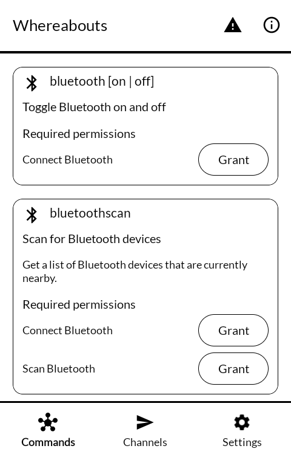
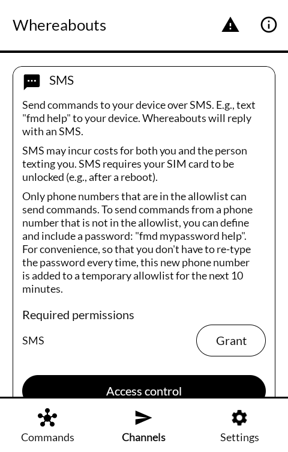
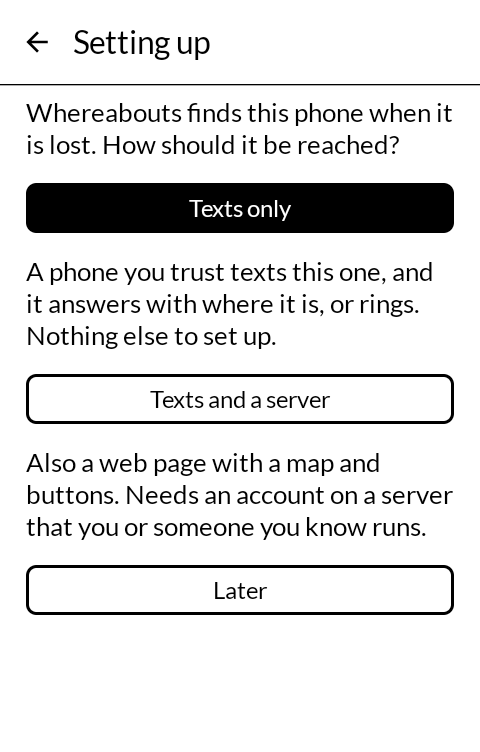
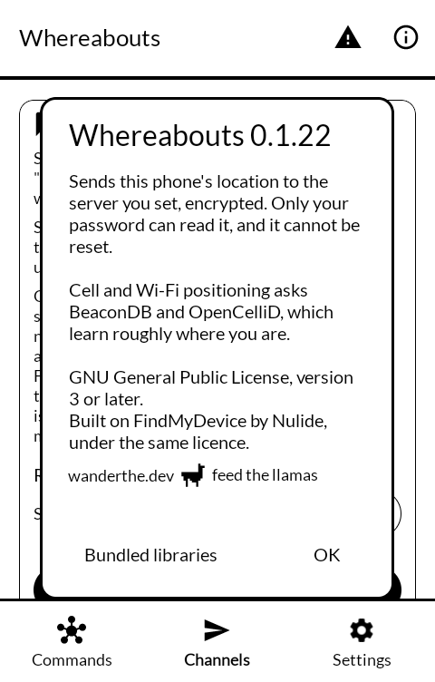

# Whereabouts (居場所, ibasho)

Find your phone when it is lost: see where it is, make it ring, or lock it.

Whereabouts sends a phone's location to a server you run yourself. The location
is encrypted on the phone before it leaves, so the server holds it without being
able to read it: only the password chosen on the device can open it, and it
cannot be reset. Commands can also be sent by SMS, with no server involved at
all.

Built for a 4.3" e-ink phone, so: no animation, no colour, one screen where one
screen will do.

| | |
|---|---|
|  |  |
|  |  |

## Wiping, and what it does not do

**Wiping is off unless the phone's owner turns it on.** Under **Settings →
General → fmd delete**, on the phone itself, the wipe command is switched on and
given a password of its own, separate from the server's. Until both are done it
refuses, so nobody can arm it from the server or by text: knowing the server
password is not enough to factory-reset someone's phone. It then answers
`delete <password>` by text or from the server's web page, and
`delete <password> dryrun` checks everything without wiping.

**It cannot take a photograph.** The camera command is gone, along with the
camera permission. A silent photo is something the person holding the phone
cannot tell has happened; that is reasonable in a stolen-phone tool and does not
belong here.

## Locating

Location comes from whatever the phone can offer: GPS, the Android fused
provider, and optionally cell towers and Wi-Fi networks looked up through
[BeaconDB](https://beacondb.net/) and [OpenCelliD](https://opencellid.org/).
Those two services learn roughly where the phone is each time they are asked;
that is the trade for working indoors, and it is off unless you turn it on.

On a degoogled phone with no network location provider, expect GPS only —
sparse, and outdoors.

## Server

It talks to [FMD Server](https://gitlab.com/fmd-foss/fmd-server), self-hosted.
There is no public instance behind this app and no default server: you enter
your own.

[Whereabouts server](https://github.com/wanderwildwood/ibasho-server) is FMD
Server with a map of the other people who share with you, including an iPhone
through the Overland app, and the same ink-on-paper look. It speaks the same
protocol, so this app works with either. With FMD Server 0.17 or later a new account uses the server's protocol
version 2, and an older account can be moved to it from the FMD Server screen.

Commands from the server reach the phone by push. Whereabouts keeps its own quiet
connection to Mozilla's push service for this, so no separate push app is needed;
if you already use one, such as Sunup or ntfy, choose it under **Push** instead.
Mozilla's service learns that the phone is connected and when your server wakes
it — not what the command is, which the phone fetches from your server itself.

## On a Mudita Kompakt

DuraSpeed, a MediaTek service on the Kompakt, closes installed apps a few
minutes after the screen goes dark and keeps them closed until they are opened
again. Until it lets Whereabouts be, the app can answer a text message but
cannot upload on its own or hear commands from the server. Its **Setup
warnings** screen says so when it happens. Mudita's own apps are on DuraSpeed's
allow list; this one has to be added, once.

Kompakt's Settings has no way in to DuraSpeed: no menu entry, and no search box
to look for it in. Its own screen will not open for another app either, but its
App info page will, and Whereabouts' **Open DuraSpeed** button, in the setup
guide and in **Setup warnings**, goes there. Then:

1. Tap **Open** on DuraSpeed's App info page.
2. Switch **Whereabouts** on in the list. **On means allowed** to run in the
   background, which is easy to read the wrong way round. Switching DuraSpeed off
   at the top works too, for every app.

If **Setup warnings** still says background running is off after that, it can be
lifted from a computer with `adb` installed: turn on developer mode (tap **Build
number** in **Settings → About** until it says so), turn on **USB debugging** in
**Settings → System → Developer options**, plug the phone in, allow the prompt,
and run

    adb shell cmd appops set com.wanderwildwood.ibasho RUN_ANY_IN_BACKGROUND allow

Ringing also needs **Display over other apps** and **Do Not Disturb access**.
Both can be granted on the phone: the app's permission buttons open the right
screens.

## Credit

Whereabouts is a fork of [FindMyDevice](https://gitlab.com/Nulide/findmydevice)
by Nulide and its contributors. **Most of the code here is theirs**, and the
parts worth thanking somebody for — the protocol, the encryption design, the
transports — are all upstream's work. What is different here is what has been
taken out and how it reads on a small grey screen.

The built-in push connection is adapted from [Sunup](https://codeberg.org/Sunup/android)
and the UnifiedPush Android distributor library, both Apache-2.0; see [NOTICE](NOTICE).

## Licence

GNU General Public License, version 3 or later — the same as upstream, whose
terms this inherits and keeps. See [LICENSE](LICENSE).

    Copyright (C) 2022-2026  Nulide and FindMyDevice contributors
    Copyright (C) 2026  wander wildwood

    This program is free software: you can redistribute it and/or modify it
    under the terms of the GNU General Public License as published by the Free
    Software Foundation, either version 3 of the License, or (at your option)
    any later version.

    This program is distributed in the hope that it will be useful, but WITHOUT
    ANY WARRANTY; without even the implied warranty of MERCHANTABILITY or
    FITNESS FOR A PARTICULAR PURPOSE.  See the GNU General Public License for
    more details.

    You should have received a copy of the GNU General Public License along
    with this program.  If not, see <https://www.gnu.org/licenses/>.
